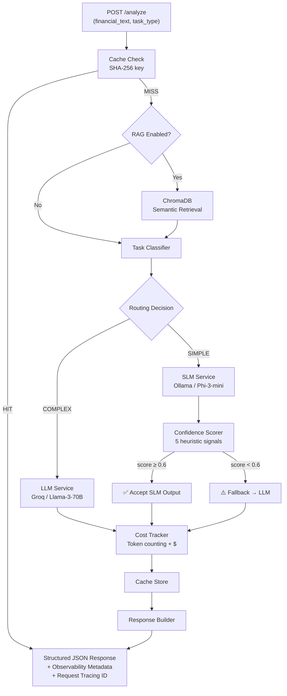

# 🏦 Hybrid SLM-LLM Financial Intelligence Pipeline


A **cost-aware AI inference orchestration system** that intelligently routes financial analysis tasks between a local Small Language Model (SLM) and a cloud Large Language Model (LLM), with RAG-powered document retrieval, response caching, per-request cost tracking, and distributed request tracing.

This is **not a chatbot**. It is a production-inspired AI backend that demonstrates model routing, confidence-based fallback, inference optimization, RAG pipelines, and modular systems engineering — the kind of infrastructure that powers real-world GenAI products.

The system processes financial text through a hybrid pipeline: lightweight tasks (summarization, extraction) are handled locally by Phi-3-mini via Ollama at near-zero cost, while complex reasoning tasks (risk analysis, trend analysis) are routed to Llama-3-70B via Groq. If the local model produces low-confidence output, the system automatically escalates to the cloud model — optimizing for both cost and quality.

---

## 🏗️ Architecture



---

## ✨ Key Features

- 🔀 **Intelligent Model Routing** — Rule-based task classification routes each request to the optimal model
- 🎯 **Confidence-Based Fallback** — 5-signal heuristic scorer automatically escalates low-quality SLM outputs to the LLM
- 💰 **Cost-Aware Inference** — Per-request cost estimation with token counting and GPT-4o savings tracking
- 🔄 **Automatic Retries** — LLM calls include exponential backoff retry logic for production reliability
- 📊 **Built-in Observability** — Request-level metrics tracking: latency, routing decisions, fallback rates, cache hit rates, cost
- 📚 **RAG Document Retrieval** — Ingest financial documents into ChromaDB and retrieve relevant context before analysis
- 🗃️ **Response Caching** — TTL-based LRU cache avoids redundant inference for identical requests
- 🔍 **Distributed Request Tracing** — Correlation IDs via `contextvars` propagated through all logs and responses
- 🏗️ **Domain Services** — Specialized services for summarization, extraction, and financial analysis with structured outputs
- ⚡ **Async-First** — Fully async FastAPI backend for high throughput
- 🐳 **Docker Ready** — One-command deployment with Docker Compose (API + Ollama)
- 🛡️ **Fail-Safe Design** — Unknown task types default to the stronger model; SLM errors gracefully trigger fallback

---

## 🛠️ Tech Stack

| Technology | Purpose | Why This Choice |
|---|---|---|
| **FastAPI** | API framework | Async-native, auto-generated OpenAPI docs, Pydantic integration |
| **Ollama** | Local SLM hosting | Simple, self-hosted, no API costs |
| **Phi-3-mini** | Small Language Model | Strong performance for its size, runs on consumer hardware |
| **Groq** | Cloud LLM provider | Free tier, extremely fast inference (~300 tok/s) |
| **Llama-3-70B** | Large Language Model | State-of-the-art open-source reasoning model |
| **LiteLLM** | LLM gateway | Unified API across providers, built-in error handling |
| **ChromaDB** | Vector database | Embedded, zero-config, built-in sentence-transformer embeddings |
| **Pydantic** | Validation + schemas | Type safety, automatic serialization, Settings management |
| **httpx** | HTTP client | Async-native, timeout support, modern Python HTTP |
| **Docker** | Containerization | Reproducible deployments, service orchestration |
| **pytest** | Testing | Industry standard, async support via pytest-asyncio |

---

## 📁 Project Structure

```
finance_pipeline/
├── app/
│   ├── main.py                  # App factory, lifespan, middleware, metrics endpoint
│   ├── config.py                # Pydantic Settings (.env-based configuration)
│   │
│   ├── api/
│   │   ├── routes.py            # POST /analyze, GET /health
│   │   ├── document_routes.py   # POST /documents/ingest, /upload, GET /search, DELETE
│   │   └── middleware.py        # Request timing + distributed tracing middleware
│   │
│   ├── router/
│   │   ├── task_classifier.py   # Rule-based SIMPLE/COMPLEX classification
│   │   └── model_router.py      # Complexity tier → model tier mapping
│   │
│   ├── models/
│   │   └── domain.py            # SummarizationResult, ExtractionResult, AnalysisResult
│   │
│   ├── schemas/
│   │   ├── requests.py          # AnalyzeRequest (with RAG options)
│   │   └── responses.py         # AnalyzeResponse (with cache, cost, tracing fields)
│   │
│   ├── services/
│   │   ├── orchestrator.py      # Central brain: cache → RAG → classify → route → infer → cost → cache
│   │   ├── cache.py             # TTL-based LRU response cache
│   │   ├── cost_tracker.py      # Per-request token counting + cost estimation
│   │   ├── document_store.py    # ChromaDB vector store wrapper
│   │   ├── chunker.py           # Text chunking with overlap for RAG ingestion
│   │   ├── summarizer.py        # Summarization service with structured output
│   │   ├── extractor.py         # Financial entity/metric extraction service
│   │   ├── analyzer.py          # Deep financial analysis service
│   │   ├── slm_service.py       # Ollama / Phi-3-mini inference (httpx)
│   │   ├── llm_service.py       # Groq / Llama-3-70B via LiteLLM (with retries)
│   │   ├── confidence.py        # 5-signal heuristic confidence scorer
│   │   └── prompt_builder.py    # Task-specific prompt construction (with RAG context)
│   │
│   └── utils/
│       ├── logger.py            # Structured logging with request ID injection
│       ├── tracing.py           # Correlation ID via contextvars
│       ├── timer.py             # Async timing context manager
│       └── metrics.py           # In-memory pipeline metrics (with cache + cost tracking)
│
├── ui/
│   └── app.py                   # Streamlit UI (analyze, documents, metrics)
│
├── tests/
│   ├── test_api.py              # API integration tests (5 tests)
│   ├── test_classifier.py       # Task classification tests (7 tests)
│   ├── test_confidence.py       # Confidence scoring tests (5 tests)
│   ├── test_router.py           # Model routing tests (2 tests)
│   ├── test_services.py         # Domain services tests (4 tests)
│   ├── test_metrics.py          # Metrics tracking tests (7 tests)
│   ├── test_cache.py            # Response cache tests (8 tests)
│   ├── test_cost_tracker.py     # Cost estimation tests (8 tests)
│   ├── test_tracing.py          # Request tracing tests (5 tests)
│   └── test_document_store.py   # Chunking + document store tests (7 tests)
│
├── Dockerfile                   # Multi-stage Python build
├── docker-compose.yml           # API + Ollama service orchestration
├── .dockerignore
├── requirements.txt
├── .env.example
├── .gitignore
└── README.md
```

---

## 🔄 How It Works

### Request Lifecycle

1. **Client** sends `POST /analyze` with `financial_text`, `task_type`, and optional `use_rag`
2. **Cache Check** — SHA-256 hash of (task_type + text) is checked against the in-memory cache
3. **RAG Retrieval** (if enabled) — ChromaDB semantic search retrieves top-k relevant document chunks
4. **Task Classifier** maps the task type to SIMPLE or COMPLEX
5. **Model Router** maps SIMPLE → SLM, COMPLEX → LLM
6. **Inference** — the appropriate model generates a response (with RAG context injected into prompt)
7. **Confidence Check** (SLM only) — 5 heuristic signals score output quality
8. **Fallback** — if SLM confidence < 0.6, automatically re-runs on LLM
9. **Cost Tracking** — token count and estimated USD cost are calculated
10. **Cache Store** — result is stored for future identical requests
11. **Metrics** — routing decision, latency, confidence, cache, and cost are recorded
12. **Response** — structured JSON with model metadata, cost, tracing ID, and analysis result

### Routing Strategy

| Task Type | Complexity | Routed To |
|---|---|---|
| `summarization` | SIMPLE | SLM (Phi-3-mini) |
| `extraction` | SIMPLE | SLM |
| `classification` | SIMPLE | SLM |
| `sentiment` | SIMPLE | SLM |
| `risk_analysis` | COMPLEX | LLM (Llama-3-70B) |
| `trend_analysis` | COMPLEX | LLM |
| `reasoning` | COMPLEX | LLM |
| `multi_step` | COMPLEX | LLM |
| `comparison` | COMPLEX | LLM |
| *(unknown)* | COMPLEX | LLM *(fail-safe)* |

### Confidence Scoring

The confidence engine uses 5 weighted heuristic signals to evaluate SLM output quality without calling another model:

| Signal | Weight | What It Catches |
|---|---|---|
| **Empty / echo** | 0.10 | Blank responses, responses under 10 characters |
| **Uncertainty phrases** | 0.30 | "I'm not sure", "I don't know", hedging language |
| **Response length** | 0.20 | Too short (< 50 chars) or excessively long (> 5000 chars) |
| **Structural validity** | 0.25 | Single-sentence responses, missing structure for extraction tasks |
| **Repetition** | 0.15 | Degenerate repetition loops (sentence appears ≥ 2 times) |

**Threshold: 0.6** — If confidence falls below this, the SLM output is discarded and the request is re-routed to the LLM.

### Response Cache

The system caches inference results to avoid redundant model calls:

- **Key**: SHA-256 hash of `(task_type + financial_text)` — content-addressed
- **TTL**: 5 minutes (configurable via `CACHE_TTL_SECONDS`)
- **Max Size**: 128 entries (configurable via `CACHE_MAX_SIZE`), LRU eviction
- **Cached response cost**: $0.00 — cache hits skip inference entirely

### Cost Tracking

Every response includes per-request cost estimation:

| Model | Input (per 1M tokens) | Output (per 1M tokens) |
|---|---|---|
| phi3:mini (Ollama) | $0.00 | $0.00 |
| llama3-70b (Groq free) | $0.00 | $0.00 |
| llama3-70b (Groq paid) | $0.59 | $0.79 |
| GPT-4o (comparison) | $5.00 | $15.00 |

Each response reports `estimated_cost_usd` and aggregate metrics track `total_cost_saved_vs_gpt4o` — quantifying the cost advantage of hybrid routing.

### RAG Document Retrieval

When `use_rag: true` is set in the request:

1. **Ingestion** — Documents uploaded via `POST /documents/ingest` or `POST /documents/upload` (PDF/text)
2. **Chunking** — Text split into 512-char chunks with 50-char overlap, splitting on sentence boundaries
3. **Embedding** — ChromaDB embeds chunks using `all-MiniLM-L6-v2` (local, free)
4. **Retrieval** — Before inference, top-k most relevant chunks are fetched via cosine similarity
5. **Augmentation** — Retrieved context is injected into the prompt alongside the user's text

### Services Layer

Three domain services provide structured analysis beyond raw text:

- **Summarizer** — Returns `SummarizationResult` with summary, key figures, and market sentiment
- **Extractor** — Returns `ExtractionResult` with entities, metrics, dates, and monetary values
- **Analyzer** — Returns `AnalysisResult` with analysis, risk level, key risks, and recommendations

Each service uses robust regex-based parsing with graceful fallbacks if the model output doesn't match the expected format.

---

## 🚀 Quick Start

### Prerequisites

- Python 3.10+
- [Ollama](https://ollama.com/) installed locally
- Free [Groq API key](https://console.groq.com/)

### Setup

```bash
# 1. Clone the repository
git clone <repo-url>
cd finance_pipeline

# 2. Create virtual environment
python3 -m venv .venv
source .venv/bin/activate

# 3. Install dependencies
pip install -r requirements.txt

# 4. Pull the SLM model
ollama pull phi3:mini

# 5. Configure environment
cp .env.example .env
# Edit .env and add your GROQ_API_KEY

# 6. Start the server
uvicorn app.main:app --reload
```

The server will start at `http://localhost:8000`. Visit `http://localhost:8000/docs` for the interactive API documentation.

### Docker Quick Start

```bash
# 1. Configure environment
cp .env.example .env
# Edit .env and add your GROQ_API_KEY

# 2. Start everything
docker compose up --build

# 3. Pull the SLM model (first time only)
docker exec finance-pipeline-ollama ollama pull phi3:mini
```

### Streamlit UI

```bash
# In a separate terminal (backend must be running):
source .venv/bin/activate
streamlit run ui/app.py
```

The UI opens at `http://localhost:8501` with three pages:
- **Analyze** — Input financial text, choose task type, toggle RAG, see results with metrics
- **Documents** — Ingest text or upload PDF/text files, search documents, manage the store
- **Metrics** — Live dashboard of request counts, cache performance, and cost tracking

---

## 📡 API Reference

### `POST /analyze` — Analyze Financial Text

```bash
curl -X POST http://localhost:8000/analyze \
  -H "Content-Type: application/json" \
  -d '{
    "financial_text": "Apple reported Q3 2024 revenue of $81.8 billion, up 5% year-over-year. Services revenue hit an all-time high of $24.2 billion. iPhone revenue was $39.3 billion. The company returned over $32 billion to shareholders through dividends and share repurchases.",
    "task_type": "summarization"
  }'
```

**Response:**

```json
{
  "selected_model": "phi3:mini",
  "routing_decision": "slm",
  "confidence_score": 0.8725,
  "latency_ms": 842.31,
  "final_response": "Apple's Q3 2024 results show solid performance...",
  "request_id": "a1b2c3d4e5f6",
  "cache_hit": false,
  "tokens_used": 245,
  "estimated_cost_usd": 0.0,
  "rag_sources_used": 0
}
```

### With RAG Context:

```bash
curl -X POST http://localhost:8000/analyze \
  -H "Content-Type: application/json" \
  -d '{
    "financial_text": "Tesla Q2 revenue declined 7% to $24.9B while margins contracted to 18.2%.",
    "task_type": "risk_analysis",
    "use_rag": true,
    "rag_top_k": 3
  }'
```

### `POST /documents/ingest` — Ingest a Financial Document

```bash
curl -X POST http://localhost:8000/documents/ingest \
  -H "Content-Type: application/json" \
  -d '{
    "text": "Apple Inc. 10-K filing ... [full document text]",
    "title": "Apple 10-K FY2024",
    "source": "SEC EDGAR"
  }'
```

```json
{
  "doc_id": "a1b2c3d4e5f6",
  "chunks_stored": 47,
  "message": "Document ingested successfully: 47 chunks stored."
}
```

### `POST /documents/upload` — Upload PDF/Text File

```bash
curl -X POST http://localhost:8000/documents/upload \
  -F "file=@earnings_report.pdf" \
  -F "title=Q3 2024 Earnings" \
  -F "source=investor_relations"
```

### `GET /documents/search` — Semantic Search

```bash
curl "http://localhost:8000/documents/search?query=revenue+growth&top_k=3"
```

### `GET /documents` — List Ingested Documents

```bash
curl http://localhost:8000/documents
```

### `DELETE /documents/{doc_id}` — Delete a Document

```bash
curl -X DELETE http://localhost:8000/documents/a1b2c3d4e5f6
```

### `GET /health` — Health Check

```bash
curl http://localhost:8000/health
# {"status": "healthy"}
```

### `GET /metrics` — Pipeline Observability

```bash
curl http://localhost:8000/metrics
```

```json
{
  "total_requests": 47,
  "slm_requests": 32,
  "llm_requests": 15,
  "fallback_count": 4,
  "fallback_rate": 0.125,
  "avg_latency_ms": 1023.45,
  "cache_hits": 12,
  "cache_misses": 35,
  "cache_hit_rate": 0.2553,
  "total_tokens_used": 11520,
  "avg_tokens_per_request": 245.1,
  "total_estimated_cost_usd": 0.003840,
  "total_cost_saved_vs_gpt4o": 0.115200
}
```

---

## 🧪 Running Tests

```bash
source .venv/bin/activate
python -m pytest tests/ -v
```

**62 tests** covering:

| Suite | Tests | Coverage |
|---|---|---|
| `test_api.py` | 5 | Health endpoint, valid requests, validation errors, internal errors |
| `test_classifier.py` | 7 | All 9 task types, unknown default, case insensitivity |
| `test_confidence.py` | 5 | Good/empty/uncertain/short/repetitive responses |
| `test_router.py` | 2 | SIMPLE→SLM, COMPLEX→LLM |
| `test_services.py` | 4 | Summarizer, extractor, analyzer (SLM + LLM paths) |
| `test_metrics.py` | 7 | Counters, averages, fallback rate, reset |
| `test_cache.py` | 8 | Cache hit/miss, TTL expiry, LRU eviction, key generation |
| `test_cost_tracker.py` | 8 | Token estimation, cost calculation, GPT-4o savings |
| `test_tracing.py` | 5 | Request ID generation, contextvar propagation |
| `test_document_store.py` | 7 | Text chunking, overlap, financial documents |

All tests mock external services — no Ollama or Groq required.

---

## 📊 Observability

Every request logs structured observability data with a correlation ID:

```
[2026-05-24 01:45:12] INFO  api.middleware              | req=a1b2c3d4e5f6 | HTTP POST /analyze | 200 | 843ms
[2026-05-24 01:45:12] INFO  router.task_classifier      | req=a1b2c3d4e5f6 | task_type=summarization → simple
[2026-05-24 01:45:12] INFO  services.orchestrator       | req=a1b2c3d4e5f6 | Routing  | task=summarization  decision=simple  tier=slm
[2026-05-24 01:45:13] INFO  services.slm_service        | req=a1b2c3d4e5f6 | SLM call  | model=phi3:mini  task=summarization  text_len=285
[2026-05-24 01:45:14] INFO  services.confidence         | req=a1b2c3d4e5f6 | Confidence 0.87  | empty=0.00  uncert=0.00  len=0.00  struct=0.00  rep=0.00
[2026-05-24 01:45:14] INFO  services.cost_tracker       | req=a1b2c3d4e5f6 | Cost estimate | model=phi3:mini  tokens=245  cost=$0.000000  saved_vs_gpt4o=$0.002450
[2026-05-24 01:45:14] INFO  services.cache              | req=a1b2c3d4e5f6 | Cache STORE | key=8f3a12b9c4d7  ttl=300s
[2026-05-24 01:45:14] INFO  utils.metrics               | req=a1b2c3d4e5f6 | Metrics  | routing=slm  confidence=0.87  latency=842ms  total=1  fallbacks=0  cache=MISS  tokens=245
```

**Tracked metrics:**
- Per-request: selected model, routing decision, confidence score, latency, cost, cache status, request ID
- Aggregate: total requests, SLM/LLM split, fallback count/rate, cache hit rate, total tokens, total cost, total savings vs GPT-4o

---

## 🐳 Docker Deployment

```bash
# Start the full stack
docker compose up --build -d

# Pull the SLM model (first time only)
docker exec finance-pipeline-ollama ollama pull phi3:mini

# Check logs
docker compose logs -f api

# Stop everything
docker compose down
```

**Services:**

| Service | Container | Port | Purpose |
|---|---|---|---|
| `api` | `finance-pipeline-api` | 8000 | FastAPI application |
| `ollama` | `finance-pipeline-ollama` | 11434 | Local SLM hosting |

**Persistent volumes:** `chroma_data` (ChromaDB), `ollama_data` (model weights)

---

## 🧠 Design Decisions

| Decision | Rationale |
|---|---|
| **Heuristic confidence (not ML)** | Zero latency overhead (~1ms), deterministic, no extra model to maintain. In production, A/B test threshold values using logged scores. |
| **Separate classifier from router** | Classifier answers "what kind of task?" — router answers "which model?". They change for different reasons and are independently testable. |
| **Orchestrator pattern** | Centralizes the cache→RAG→classify→route→infer→confidence→fallback→cost flow. Keeps API layer thin, business logic in one place. |
| **Content-addressed cache** | SHA-256 hash of (task_type + text) means identical requests always hit the same cache entry. TTL prevents stale data. |
| **Cost tracking even when free** | Even though Groq's free tier is $0, we track estimated paid-tier costs and savings vs GPT-4o. This quantifies the economic value of hybrid routing. |
| **RAG as opt-in** | `use_rag: false` by default — zero overhead unless requested. Keeps simple requests fast while enabling context enrichment for complex analysis. |
| **Correlation IDs via contextvars** | Every log line includes `req=<id>` — zero-overhead tracing that propagates automatically through async code without explicit parameter passing. |
| **Raw httpx for Ollama, LiteLLM for Groq** | Ollama's API is trivial — adding LiteLLM is overhead. Groq has rate limits, error codes, and provider quirks that LiteLLM handles. |
| **Retry with backoff on LLM, not SLM** | Cloud APIs have transient failures (rate limits, timeouts). Local Ollama either works or doesn't — retrying won't help. |
| **Fail-safe to COMPLEX** | Unknown task types go to the stronger model. Prefer paying more over returning garbage. |
| **Docker Compose for deployment** | One-command setup. API container auto-connects to Ollama container via Docker networking. Persistent volumes preserve data across restarts. |
| **No auth / rate limiting** | Out of scope. In production, this sits behind an API gateway (Kong, Envoy) that handles auth. |
| **Thread-safe metrics** | Uses `threading.Lock` for safe concurrent access — lightweight alternative to Prometheus for development. |

---

## 🎯 Interview Discussion Points

Use these to explain the project in a technical interview:

1. **Cost-Aware Inference Routing** — "I built a system where simple tasks run on a free local model, and only complex tasks hit the paid API. Every response tracks estimated cost and savings vs GPT-4o — the system has saved $X across Y requests."

2. **Response Caching** — "Before hitting any model, we check a content-addressed cache keyed on SHA-256(task_type + text). This means if 10 analysts ask for the same earnings summary, we only run inference once. Cache hit rate is tracked in /metrics."

3. **RAG Pipeline** — "The system isn't limited to inline text. You can ingest financial documents (10-Ks, earnings reports) into ChromaDB, and when use_rag is enabled, the top-k most relevant chunks are retrieved and injected into the prompt. This dramatically improves analysis quality for tasks like trend_analysis."

4. **Confidence-Based Fallback** — "Rather than blindly trusting the small model, I implemented a heuristic confidence scorer that checks for uncertainty language, response quality, and structural issues. If confidence drops below 0.6, the system automatically escalates to the stronger model."

5. **Why Heuristics Over ML for Confidence** — "Adding a second ML model to judge the first adds latency, cost, and another failure point. Heuristics run in ~1ms, are deterministic, and easy to debug. In production, you'd use logged confidence scores to tune thresholds via A/B testing."

6. **Distributed Tracing** — "Every request gets a correlation ID that propagates through contextvars. Every log line, from classification to inference to caching, includes the same request ID. In production, this ID would propagate to downstream services via headers."

7. **Graceful Degradation** — "If Ollama is down, SLM calls return empty strings. The confidence scorer catches this (empty penalty), triggering automatic LLM fallback. The system never crashes — it just gets more expensive."

8. **Docker Deployment** — "The entire stack runs with docker compose up — API, Ollama, and persistent ChromaDB storage. In production, you'd add Prometheus and Grafana containers to this compose file."

9. **Separation of Concerns** — "The classifier decides task complexity, the router maps complexity to models, services define domain-specific prompts, the cache handles deduplication, the cost tracker handles economics, and the orchestrator coordinates everything. Each component is independently testable."

10. **Production Scaling** — "This is stateless — horizontal scaling is just adding more FastAPI workers behind a load balancer. Cache and metrics would move to Redis and Prometheus respectively. ChromaDB would move to a managed vector database."

---

## 🔮 Future Improvements

- **ML-Based Task Classifier** — Train a small classifier to replace keyword routing
- **Response Streaming** — SSE support for real-time LLM output
- **Rate Limiting** — Per-client request throttling
- **Prometheus Metrics** — Export observability data for Grafana dashboards
- **A/B Testing Framework** — Compare model performance with live traffic
- **Multi-Model Ensemble** — Run both models and compare for quality evaluation
- **Structured JSON Output** — Use model JSON mode instead of regex parsing
- **OpenTelemetry Tracing** — Full span-based distributed tracing with Jaeger

---

## 📄 License

MIT License — see [LICENSE](LICENSE) for details.
