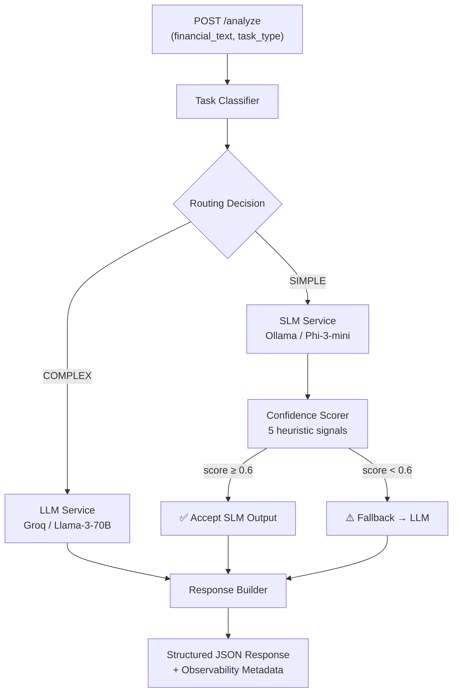

# 🏦 Hybrid SLM-LLM Financial Intelligence Pipeline


A **cost-aware AI inference orchestration system** that intelligently routes financial analysis tasks between a local Small Language Model (SLM) and a cloud Large Language Model (LLM).

This is **not a chatbot**. It is a production-inspired AI backend that demonstrates model routing, confidence-based fallback, inference optimization, and modular systems engineering — the kind of infrastructure that powers real-world GenAI products.

The system processes financial text through a hybrid pipeline: lightweight tasks (summarization, extraction) are handled locally by Phi-3-mini via Ollama at near-zero cost, while complex reasoning tasks (risk analysis, trend analysis) are routed to Llama-3-70B via Groq. If the local model produces low-confidence output, the system automatically escalates to the cloud model — optimizing for both cost and quality.

---

## 🏗️ Architecture



---

## ✨ Key Features

- 🔀 **Intelligent Model Routing** — Rule-based task classification routes each request to the optimal model
- 🎯 **Confidence-Based Fallback** — 5-signal heuristic scorer automatically escalates low-quality SLM outputs to the LLM
- 💰 **Cost-Aware Inference** — Simple tasks stay local (free), complex tasks go to cloud (paid) — only when needed
- 🔄 **Automatic Retries** — LLM calls include exponential backoff retry logic for production reliability
- 📊 **Built-in Observability** — Request-level metrics tracking: latency, routing decisions, fallback rates
- 🏗️ **Domain Services** — Specialized services for summarization, extraction, and financial analysis with structured outputs
- ⚡ **Async-First** — Fully async FastAPI backend for high throughput
- 🛡️ **Fail-Safe Design** — Unknown task types default to the stronger model; SLM errors gracefully trigger fallback

---

## 🛠️ Tech Stack

| Technology | Purpose | Why This Choice |
|---|---|---|
| **FastAPI** | API framework | Async-native, auto-generated OpenAPI docs, Pydantic integration |
| **Ollama** | Local SLM hosting | Simple, self-hosted, no API costs |
| **Phi-3-mini** | Small Language Model | Strong performance for its size, runs on consumer hardware |
| **Groq** | Cloud LLM provider | Free tier, extremely fast inference (~300 tok/s) |
| **Llama-3-70B** | Large Language Model | State-of-the-art open-source reasoning model |
| **LiteLLM** | LLM gateway | Unified API across providers, built-in error handling |
| **Pydantic** | Validation + schemas | Type safety, automatic serialization, Settings management |
| **httpx** | HTTP client | Async-native, timeout support, modern Python HTTP |
| **pytest** | Testing | Industry standard, async support via pytest-asyncio |

---

## 📁 Project Structure

```
finance_pipeline/
├── app/
│   ├── main.py                  # App factory, lifespan, middleware, metrics endpoint
│   ├── config.py                # Pydantic Settings (.env-based configuration)
│   │
│   ├── api/
│   │   ├── routes.py            # POST /analyze, GET /health
│   │   └── middleware.py        # Request timing middleware (X-Process-Time-Ms)
│   │
│   ├── router/
│   │   ├── task_classifier.py   # Rule-based SIMPLE/COMPLEX classification
│   │   └── model_router.py      # Complexity tier → model tier mapping
│   │
│   ├── models/
│   │   └── domain.py            # SummarizationResult, ExtractionResult, AnalysisResult
│   │
│   ├── schemas/
│   │   ├── requests.py          # AnalyzeRequest
│   │   └── responses.py         # AnalyzeResponse
│   │
│   ├── services/
│   │   ├── orchestrator.py      # Central brain: classify → route → infer → confidence → fallback
│   │   ├── summarizer.py        # Summarization service with structured output
│   │   ├── extractor.py         # Financial entity/metric extraction service
│   │   ├── analyzer.py          # Deep financial analysis service
│   │   ├── slm_service.py       # Ollama / Phi-3-mini inference (httpx)
│   │   ├── llm_service.py       # Groq / Llama-3-70B via LiteLLM (with retries)
│   │   ├── confidence.py        # 5-signal heuristic confidence scorer
│   │   └── prompt_builder.py    # Task-specific prompt construction
│   │
│   └── utils/
│       ├── logger.py            # Structured logging configuration
│       ├── timer.py             # Async timing context manager
│       └── metrics.py           # In-memory pipeline metrics tracker
│
├── tests/
│   ├── test_api.py              # API integration tests (5 tests)
│   ├── test_classifier.py       # Task classification tests (7 tests)
│   ├── test_confidence.py       # Confidence scoring tests (5 tests)
│   ├── test_router.py           # Model routing tests (2 tests)
│   ├── test_services.py         # Domain services tests (4 tests)
│   └── test_metrics.py          # Metrics tracking tests (7 tests)
│
├── requirements.txt
├── .env.example
├── .gitignore
└── README.md
```

---

## 🔄 How It Works

### Request Lifecycle

1. **Client** sends `POST /analyze` with `financial_text` and `task_type`
2. **Task Classifier** maps the task type to SIMPLE or COMPLEX
3. **Model Router** maps SIMPLE → SLM, COMPLEX → LLM
4. **Inference** — the appropriate model generates a response
5. **Confidence Check** (SLM only) — 5 heuristic signals score output quality
6. **Fallback** — if SLM confidence < 0.6, automatically re-runs on LLM
7. **Metrics** — routing decision, latency, and confidence are recorded
8. **Response** — structured JSON with model metadata and analysis result

### Routing Strategy

| Task Type | Complexity | Routed To |
|---|---|---|
| `summarization` | SIMPLE | SLM (Phi-3-mini) |
| `extraction` | SIMPLE | SLM |
| `classification` | SIMPLE | SLM |
| `sentiment` | SIMPLE | SLM |
| `risk_analysis` | COMPLEX | LLM (Llama-3-70B) |
| `trend_analysis` | COMPLEX | LLM |
| `reasoning` | COMPLEX | LLM |
| `multi_step` | COMPLEX | LLM |
| `comparison` | COMPLEX | LLM |
| *(unknown)* | COMPLEX | LLM *(fail-safe)* |

### Confidence Scoring

The confidence engine uses 5 weighted heuristic signals to evaluate SLM output quality without calling another model:

| Signal | Weight | What It Catches |
|---|---|---|
| **Empty / echo** | 0.10 | Blank responses, responses under 10 characters |
| **Uncertainty phrases** | 0.30 | "I'm not sure", "I don't know", hedging language |
| **Response length** | 0.20 | Too short (< 50 chars) or excessively long (> 5000 chars) |
| **Structural validity** | 0.25 | Single-sentence responses, missing structure for extraction tasks |
| **Repetition** | 0.15 | Degenerate repetition loops (sentence appears ≥ 2 times) |

**Threshold: 0.6** — If confidence falls below this, the SLM output is discarded and the request is re-routed to the LLM.

### Services Layer

Three domain services provide structured analysis beyond raw text:

- **Summarizer** — Returns `SummarizationResult` with summary, key figures, and market sentiment
- **Extractor** — Returns `ExtractionResult` with entities, metrics, dates, and monetary values
- **Analyzer** — Returns `AnalysisResult` with analysis, risk level, key risks, and recommendations

Each service uses robust regex-based parsing with graceful fallbacks if the model output doesn't match the expected format.

---

## 🚀 Quick Start

### Prerequisites

- Python 3.10+
- [Ollama](https://ollama.com/) installed locally
- Free [Groq API key](https://console.groq.com/)

### Setup

```bash
# 1. Clone the repository
git clone <repo-url>
cd finance_pipeline

# 2. Create virtual environment
python3 -m venv .venv
source .venv/bin/activate

# 3. Install dependencies
pip install -r requirements.txt

# 4. Pull the SLM model
ollama pull phi3:mini

# 5. Configure environment
cp .env.example .env
# Edit .env and add your GROQ_API_KEY

# 6. Start the server
uvicorn app.main:app --reload
```

The server will start at `http://localhost:8000`. Visit `http://localhost:8000/docs` for the interactive API documentation.

---

## 📡 API Reference

### `POST /analyze` — Analyze Financial Text

```bash
curl -X POST http://localhost:8000/analyze \
  -H "Content-Type: application/json" \
  -d '{
    "financial_text": "Apple reported Q3 2024 revenue of $81.8 billion, up 5% year-over-year. Services revenue hit an all-time high of $24.2 billion. iPhone revenue was $39.3 billion. The company returned over $32 billion to shareholders through dividends and share repurchases.",
    "task_type": "summarization"
  }'
```

**Response:**

```json
{
  "selected_model": "phi3:mini",
  "routing_decision": "slm",
  "confidence_score": 0.8725,
  "latency_ms": 842.31,
  "final_response": "Apple's Q3 2024 results show solid performance with total revenue of $81.8B (+5% YoY). Key highlights include record Services revenue of $24.2B and iPhone contributing $39.3B. The company maintained strong shareholder returns with $32B+ in buybacks and dividends."
}
```

### Complex Task (Routes to LLM):

```bash
curl -X POST http://localhost:8000/analyze \
  -H "Content-Type: application/json" \
  -d '{
    "financial_text": "Tesla Q2 revenue declined 7% to $24.9B while margins contracted to 18.2%. Competition from BYD intensified in China. The Cybertruck ramp continues with negative gross margins. Energy storage deployments grew 157% YoY.",
    "task_type": "risk_analysis"
  }'
```

### `GET /health` — Health Check

```bash
curl http://localhost:8000/health
# {"status": "healthy"}
```

### `GET /metrics` — Pipeline Observability

```bash
curl http://localhost:8000/metrics
```

```json
{
  "total_requests": 47,
  "slm_requests": 32,
  "llm_requests": 15,
  "fallback_count": 4,
  "fallback_rate": 0.125,
  "avg_latency_ms": 1023.45
}
```

---

## 🧪 Running Tests

```bash
source .venv/bin/activate
python -m pytest tests/ -v
```

**34 tests** covering:

| Suite | Tests | Coverage |
|---|---|---|
| `test_api.py` | 5 | Health endpoint, valid requests, validation errors, internal errors |
| `test_classifier.py` | 7 | All 9 task types, unknown default, case insensitivity |
| `test_confidence.py` | 5 | Good/empty/uncertain/short/repetitive responses |
| `test_router.py` | 2 | SIMPLE→SLM, COMPLEX→LLM |
| `test_services.py` | 4 | Summarizer, extractor, analyzer (SLM + LLM paths) |
| `test_metrics.py` | 7 | Counters, averages, fallback rate, reset |

All tests mock external services — no Ollama or Groq required.

---

## 📊 Observability

Every request logs structured observability data:

```
[2026-05-24 01:45:12] INFO  router.task_classifier     | task_type=summarization → simple
[2026-05-24 01:45:12] INFO  services.orchestrator      | Routing  | task=summarization  decision=simple  tier=slm
[2026-05-24 01:45:13] INFO  services.slm_service       | SLM call  | model=phi3:mini  task=summarization  text_len=285
[2026-05-24 01:45:14] INFO  services.slm_service       | SLM done  | response_len=347
[2026-05-24 01:45:14] INFO  services.confidence        | Confidence 0.87  | empty=0.00  uncert=0.00  len=0.00  struct=0.00  rep=0.00
[2026-05-24 01:45:14] INFO  utils.metrics              | Metrics  | routing=slm  confidence=0.87  latency=842ms  total=1  fallbacks=0
[2026-05-24 01:45:14] INFO  services.orchestrator      | Done  | model=phi3:mini  routing=slm  confidence=0.87  latency=842ms
[2026-05-24 01:45:14] INFO  api.middleware              | HTTP POST /analyze | 200 | 843ms
```

**Tracked metrics:**
- Per-request: selected model, routing decision, confidence score, latency
- Aggregate: total requests, SLM/LLM split, fallback count, fallback rate, average latency

---

## 🧠 Design Decisions

| Decision | Rationale |
|---|---|
| **Heuristic confidence (not ML)** | Zero latency overhead (~1ms), deterministic, no extra model to maintain. In production, A/B test threshold values using logged scores. |
| **Separate classifier from router** | Classifier answers "what kind of task?" — router answers "which model?". They change for different reasons and are independently testable. |
| **Orchestrator pattern** | Centralizes the classify→route→infer→confidence→fallback flow. Keeps API layer thin, business logic in one place. |
| **Raw httpx for Ollama, LiteLLM for Groq** | Ollama's API is trivial — adding LiteLLM is overhead. Groq has rate limits, error codes, and provider quirks that LiteLLM handles. |
| **Retry with backoff on LLM, not SLM** | Cloud APIs have transient failures (rate limits, timeouts). Local Ollama either works or doesn't — retrying won't help. |
| **Fail-safe to COMPLEX** | Unknown task types go to the stronger model. Prefer paying more over returning garbage. |
| **No database** | Stateless by design. Each request is independent. Adding persistence (ChromaDB, RAG) is additive — no refactor needed. |
| **No auth / rate limiting** | Out of scope. In production, this sits behind an API gateway (Kong, Envoy) that handles auth. |
| **Thread-safe metrics** | Uses `threading.Lock` for safe concurrent access — lightweight alternative to Prometheus for development. |

---

## 🎯 Interview Discussion Points

Use these to explain the project in a technical interview:

1. **Cost-Aware Inference Routing** — "I built a system where simple tasks run on a free local model, and only complex tasks hit the paid API. The routing is rule-based today but designed to be swappable with an ML classifier."

2. **Confidence-Based Fallback** — "Rather than blindly trusting the small model, I implemented a heuristic confidence scorer that checks for uncertainty language, response quality, and structural issues. If confidence drops below 0.6, the system automatically escalates to the stronger model."

3. **Why Heuristics Over ML for Confidence** — "Adding a second ML model to judge the first adds latency, cost, and another failure point. Heuristics run in ~1ms, are deterministic, and easy to debug. In production, you'd use logged confidence scores to tune thresholds via A/B testing."

4. **Graceful Degradation** — "If Ollama is down, SLM calls return empty strings. The confidence scorer catches this (empty penalty), triggering automatic LLM fallback. The system never crashes — it just gets more expensive."

5. **Retry Strategy** — "Cloud LLM calls use exponential backoff (1s, 2s, 4s) for transient failures like rate limits. Local SLM calls don't retry because if Ollama isn't responding, waiting won't help."

6. **Observability Without Overhead** — "Every request logs model selection, latency, confidence, and routing. Aggregate metrics (fallback rate, average latency) are available at GET /metrics. This is lightweight enough for development — in production, you'd export to Prometheus/Grafana."

7. **Separation of Concerns** — "The classifier decides task complexity, the router maps complexity to models, services define domain-specific prompts, and the orchestrator coordinates everything. Each component is independently testable."

8. **Production Scaling** — "This is stateless — horizontal scaling is just adding more FastAPI workers behind a load balancer. The only state is the metrics counter, which in production would be replaced by Prometheus."

9. **Why Not LangChain** — "LangChain adds significant abstraction overhead and makes debugging harder. For a targeted pipeline like this, direct API calls with a thin service layer are more maintainable and easier to explain."

10. **Future Extensions** — "The architecture is designed for incremental enhancement: swap the keyword classifier with an ML model, add RAG with ChromaDB, add streaming with SSE, add cost tracking per request — each change is additive, not a refactor."

---

## 🔮 Future Improvements

- **ChromaDB + RAG** — Retrieve relevant context from financial documents before analysis
- **ML-Based Task Classifier** — Train a small classifier to replace keyword routing
- **Response Streaming** — SSE support for real-time LLM output
- **Rate Limiting** — Per-client request throttling
- **Prometheus Metrics** — Export observability data for Grafana dashboards
- **A/B Testing Framework** — Compare model performance with live traffic
- **Cost Tracking** — Per-request cost estimation based on token counts
- **Caching Layer** — Cache identical requests to avoid redundant inference
- **Multi-Model Ensemble** — Run both models and compare for quality evaluation

---

## 📄 License

MIT License — see [LICENSE](LICENSE) for details.
